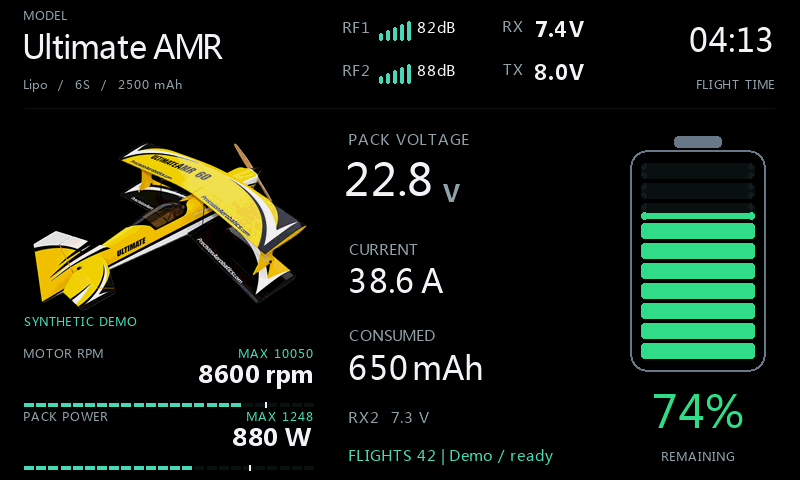
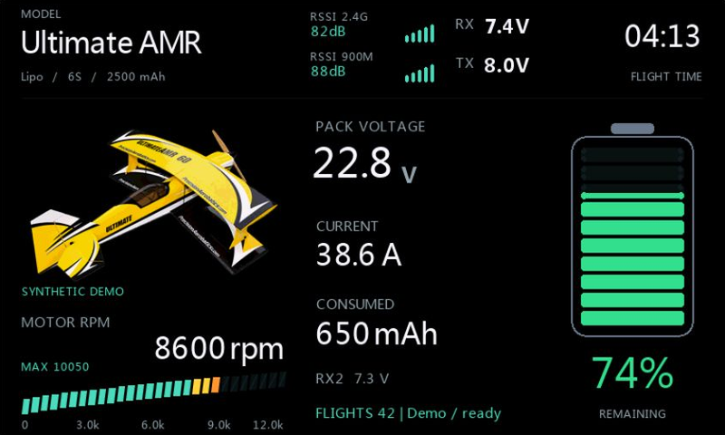
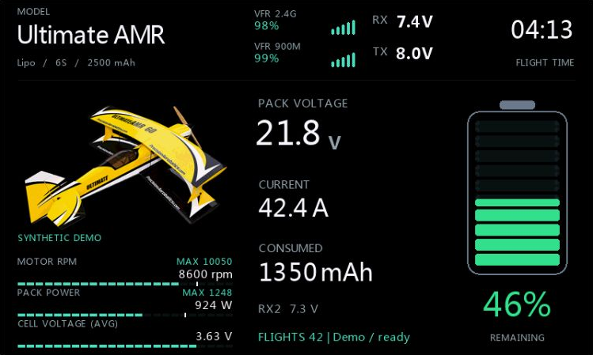
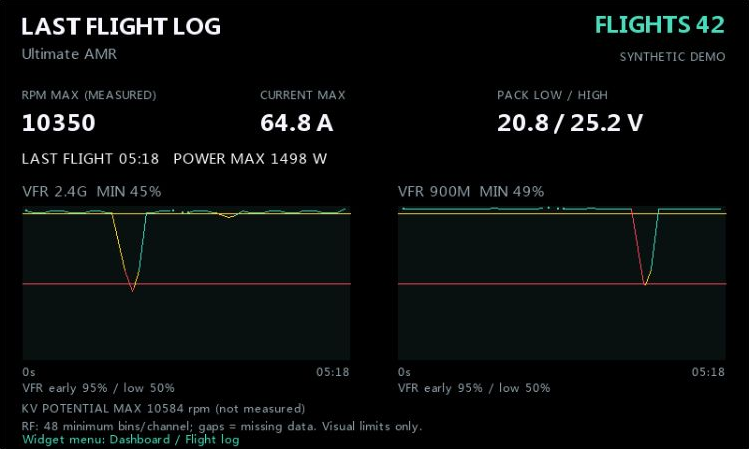
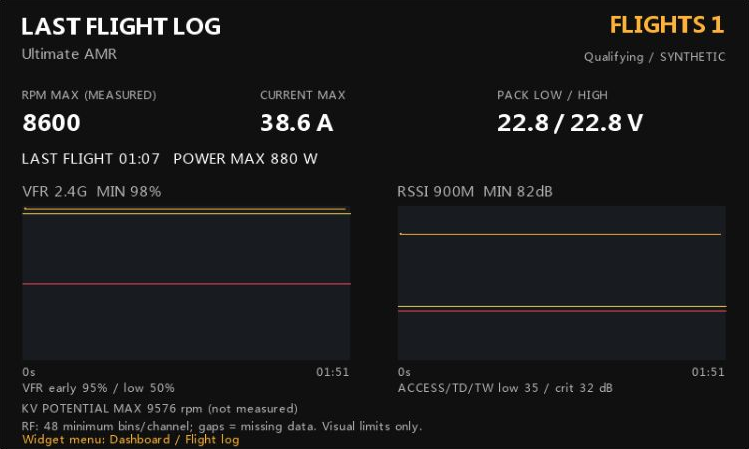

# Ethos Widgets

## VoltDeck
A full-screen battery, telemetry and power dashboard for FrSky ETHOS.

**VoltDeck 2026.10-v2: latest release. Physical X20RS/model testing
passed, confirmed by the owner on 2026-10-05.**

[Download VoltDeck-2026.10-v2.zip](https://github.com/bliatun-code/Ethos-Widgets/releases/download/voltdeck-2026.10-v2/VoltDeck-2026.10-v2.zip) | [Release notes](https://github.com/bliatun-code/Ethos-Widgets/releases/tag/voltdeck-2026.10-v2)

The screen above uses synthetic demonstration values, not a recorded flight.

[Illustrated configuration guide](docs/Configuration.md) |
[Norsk veiledning](docs/Konfigurasjon-norsk.md) |
[Installation and technical notes](docs/VoltDeck.md) |
[Lua source](scripts/VoltDeck/main.lua)

## Choose your lower deck

<table>
<tr>
<td> <b>Retro LCD RPM</b> Segmented scale and session peak.</td>
<td> <b>RPM + Watts</b> Measured speed beside calculated electrical input power.</td>
</tr>
<tr>
<td> <b>Three values</b> RPM, Watts and average cell voltage.</td>
<td> <b>Flight summary</b> Peaks, duration and bounded RF history.</td>
</tr>
</table>

All gallery screens are native ETHOS simulator renders with synthetic
readings. The example flight count is illustrative, not a flight-test result.
The Ultimate AMR picture is documentation artwork, not a required widget asset.

## Highlights

- Active model name and optional reuse of its selected model picture.
- Radio theme, black or user-selected background and accent colors.
- Remaining battery from consumed mAh; optional percent source or voltage estimate.
- Green / yellow / orange / red battery thresholds and configurable low-battery WAV.
- Measured RPM, a labelled KV estimate, Watts, average cell voltage or custom telemetry.
- Numeric and retro LCD presentation; one, two or three supported metrics.
- Optional per-model flight counter, session peaks and last-flight RF graphs.
- Optional automatic flight-log opening after sustained pack-voltage loss.
- Source-named RSSI/VFR readings, correct inactive units and per-slot visual profiles.
- Readable Lua source. No bundled bytecode, fonts, sounds or runtime artwork.

## Install VoltDeck

1. Download [VoltDeck-2026.10-v2.zip](https://github.com/bliatun-code/Ethos-Widgets/releases/download/voltdeck-2026.10-v2/VoltDeck-2026.10-v2.zip) from the release assets, not GitHub's automatically generated source archive.
2. Extract its `scripts/VoltDeck` folder onto the radio SD card so the final path is `scripts/VoltDeck/main.lua`.
3. Restart ETHOS, create a full-screen widget area and select **VoltDeck**.
4. Configure the sensors and battery capacity for that particular model.

The named ZIP includes the widget folder, installation instructions, license
and notices. No standalone Lua download is needed. Keep existing per-model
`.cfg` and `.dat` files when upgrading. If an older `main.luac` remains in
`scripts/VoltDeck`, remove only that generated file before restarting ETHOS
so it can compile the installed source. Do not rename `main.lua` or install
the private simulator helpers.
Upgrading from the experimental Batt-key build requires selecting VoltDeck
again and reselecting its telemetry sources.

## Pack sessions and last flight

Motor disarming pauses qualification/flight time but retains the same pack
session, its statistics and RF history. Rearming does not count another flight.
Only continuous loss of valid positive pack voltage for **Pack loss delay**
ends the session (default 10 s; adjustable 3-120 s).
The previous **End delay** setting retains its saved value under this new name.

The last qualified log stays visible after disconnecting the aircraft and while
the next flight is qualifying. It is replaced only when that next flight qualifies.
These logs stay in RAM, not across a radio restart. RF graphs include motor pauses;
the flight-time figure only accumulates while all qualification gates pass.
An extended telemetry loss can resemble a disconnected battery; choose a longer
delay, for example 30 s, if needed. No battery-swap sensor is implied.

This synthetic simulator snapshot still shows count 1 and the previous flight
while the next candidate qualifies. [See all four transitions](docs/Configuration.md#illustrated-pack-session-transitions).

### Optional automatic flight log

Enable **Auto-open log** under **Flight log** (default Off), then set
**Extra log delay** (default 5 s, range 0-120 s). This additional delay starts
after **Pack loss delay** completes a qualified session. Returning pack voltage
or a manual view/settings change cancels pending navigation.
See the [configuration guide](docs/Configuration.md#automatic-flight-log-view).

2026.10-v2 also handles cleanup without a widget instance, fixing the nil
`widget` error reported on 2026.9-v2. The owner confirmed physical-radio
testing of the complete update on 2026-10-05. All 53 focused regression cases
and 25 native ETHOS simulator cases passed, including a simulator restart.

## RF names and visual profiles

Names follow the selected source, for example **RSSI 2.4G** or **VFR 900M**.
Dashboard and flight-log sources can differ. Presets use RSSI low/critical
35/32 dB for ACCESS/TD/TW or 45/42 dB for ACCST.
The widget's VFR visual profile is yellow at <=95% and red at <=50%;
95% is an early-quality marker, not FrSky's native alarm threshold.
Existing model limits migrate to **Custom** without being silently replaced.
See the [RF explanation](docs/Configuration.md#11-vfr-graphs-instead-of-rssi).

## Safety and compatibility

Simulator target: **FrSky X20RS, ETHOS 26.1.2**.
The owner reported that physical X20RS/model testing passed on 2026-10-05.
This is a project test report, not universal compatibility or safety certification.
Other radio/firmware combinations are not yet confirmed.
Keep native telemetry alarms, failsafe and pre-flight checks enabled.
An armed bench run can still qualify as a flight; use an appropriate airborne
gate when possible. The widget's graph colors do not configure radio alarms.

RF rendering is bounded: up to 180 history points are reduced to at most
48 minimum-preserving time bins per channel. Missing data breaks the trace;
no averaging hides brief lows. Geometry is prepared over several wakeups,
then paint draws cached primitives. Live traces can lag by a few seconds.
The updated RF examples use 180 synthetic input points. The owner separately
confirmed that physical X20RS/model testing of 2026.10-v2 passed on 2026-10-05.
Other hardware, firmware and model setups still need their own checks.

The release packages the same 2026.10-v2 Lua source that the owner tested.
Documentation and example-image updates do not change the widget code.

## License and publication boundary

Our Lua implementation is published under [MIT](LICENSE). See [NOTICE](NOTICE.md)
for the separate status of owner-supplied demonstration artwork.

Public files are explicitly selected: Lua source, documentation and curated
example images. Internal notes, test tools, packet feeders, native model files,
live telemetry logs and generated per-model state stay private.
