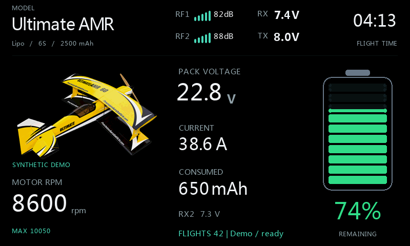
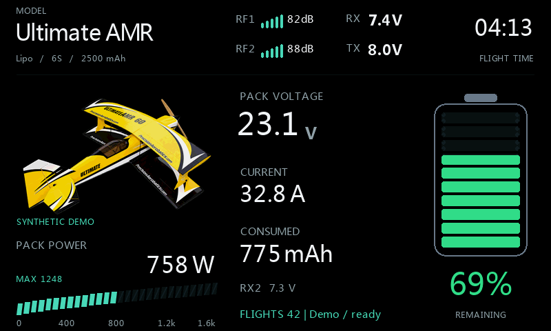
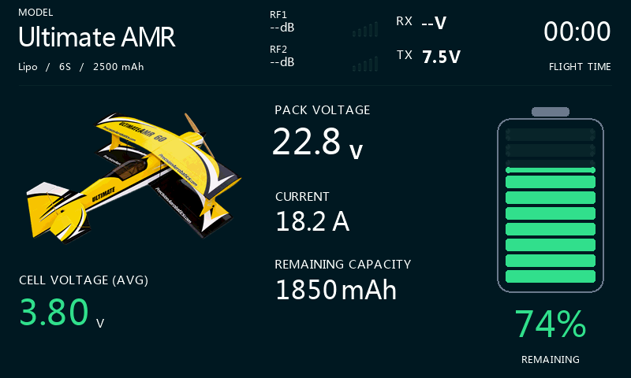
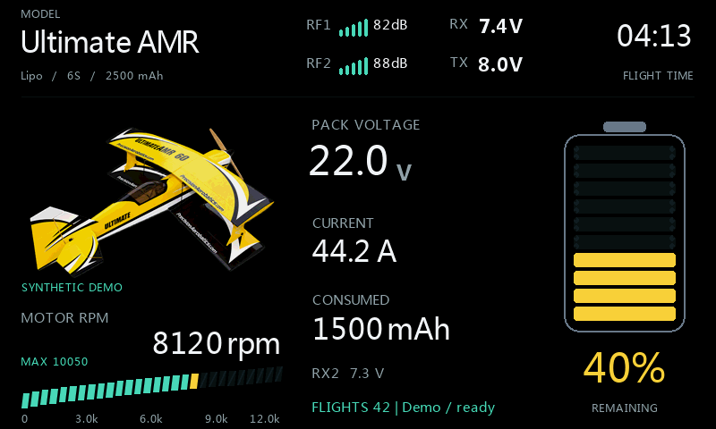
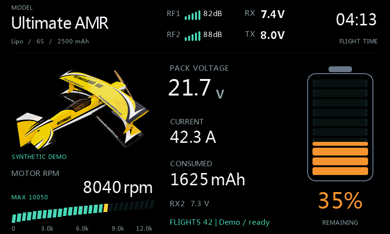
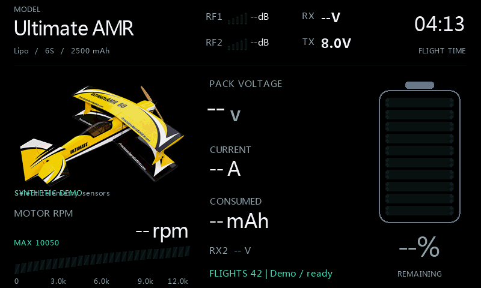
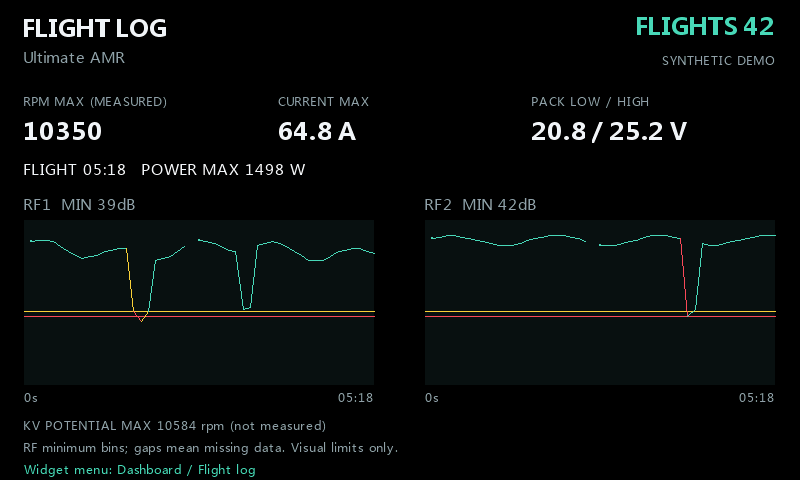

# VoltDeck: illustrated configuration guide

[Home](../README.md) | [Installation](VoltDeck.md) | [Norsk](Konfigurasjon-norsk.md)

**These are native FrSky ETHOS 26.1.2 simulator screenshots using synthetic
demonstration readings. They are not field measurements, flight-test evidence
or a promise of compatibility with another radio.**

The gallery uses the actual widget drawing and calculation functions.
A private simulator fixture supplies values and a fabricated last-flight
record. It does not write an actual flight count. No fixture is distributed.
This guide targets the development build while physical testing is in progress.

## 1. Start with the model and battery

Install `scripts/VoltDeck/main.lua`, select **VoltDeck** in a full-screen
widget area and open its configuration. The visible model name comes from
the active ETHOS model, not hard-coded text.

| Configuration group | Field | Example |
|---|---|---|
| Battery | Remaining from | Consumed mAh |
| Battery | Battery type | Lipo |
| Battery | Capacity | 2500 mAh |
| Battery | Cells | 6 |
| Battery | mAh display | Consumed |
| Appearance | Background | Black |
| Appearance | Image source | Selected model |
| Appearance | Font file | Leave blank for native ETHOS fonts |
| Telemetry | Pack voltage | Your pack-voltage source, in V |
| Telemetry | Current | Your current source, in A |
| Telemetry | Consumed mAh | Your ESC/sensor consumption source |
| Motor / RPM | RPM source | Your actual mechanical RPM source |

Sensor names depend on the model's equipment. Do not search for the private
demo sensors or import an unrelated model's native sensor record.
Check the configured cell count and consumption reset before every new pack.

At 650 mAh consumed from a 2500 mAh pack:

```text
remaining mAh = 2500 - 650 = 1850
remaining %  = 100 * 1850 / 2500 = 74%
```

The result is clamped to 0..100%. This is a capacity calculation, not a
direct cell-voltage measurement. An inaccurate current/consumption sensor,
wrong capacity or unreset counter produces an inaccurate percentage.

## 2. Retro LCD RPM


| Group | Field | Setting |
|---|---|---|
| Lower deck | Show | RPM |
| Lower deck | Meter style | Retro LCD |
| Lower deck | Red zone | 85% of the configured meter range |
| Motor / RPM | RPM value | Measured RPM |
| Motor / RPM | RPM scale | Manual |
| Motor / RPM | RPM max | 12000 rpm |

The example shows **8600 rpm** with an illustrative **10050 rpm** session
peak. Its scale remains fixed at 12000, so a falling reading does not
silently change the reference range. The rising segmented bar is a
presentation of telemetry, not an independent speed measurement.

A session peak is not necessarily a last-flight peak. Use **Reset live peaks**
from the widget menu when a fresh session is needed.

## 3. Retro LCD RPM + Watts


Keep the RPM settings above, then choose:

| Group | Field | Setting |
|---|---|---|
| Lower deck | Show | RPM + Watts |
| Lower deck | Meter style | Retro LCD |
| Lower deck | Watt max | 1600 W |

VoltDeck calculates electrical input power from the selected pack voltage
and current sources. You do not need to create another sensor just to show it:

```text
22.8 V * 38.6 A = 880.08 W
```

The display rounds this to **880 W**. This is electrical input power, not
shaft power or propeller thrust. Both readings must be valid; missing
voltage or current produces dashes, not a fabricated zero.

## 4. Three metrics: RPM + Watts + average cell voltage


Set **Lower deck / Show = RPM + W + cell** and **Meter style = Retro LCD**.
The lower deck uses three compact rows automatically.

The example uses **21.8 V**, **42.4 A** and **6 cells**:

```text
input power = 21.8 * 42.4 = 924.32 W
average cell voltage = 21.8 / 6 = 3.63 V
```

Average cell voltage cannot reveal which individual cell is weak. Use a
real cell-monitoring source when individual-cell safety information matters.

## 5. Numeric RPM, standalone Watts and cell voltage

<table>
<tr>
<td><br><b>Numeric RPM</b><br>Show = RPM; Meter style = Numeric.</td>
<td><br><b>Standalone Watts</b><br>Show = Watts; Meter style = Retro LCD.</td>
</tr>
</table>



For the blue-background example, select **Background = Custom**, choose a
dark blue **Background color** and a blue **Accent color**. Choose
**Show = Cell volts**, **Meter style = Numeric**, and
**Battery / mAh display = Remaining**.

**Background = Radio theme** follows ETHOS theme colors.
**Background = Black** is pure black. Custom colors are independent of
the model picture; transparency lets the chosen background show through.

## 6. Custom telemetry


| Group | Field | Example |
|---|---|---|
| Lower deck | Show | Custom |
| Lower deck | Meter style | Retro LCD |
| Lower deck | Custom source | ESC temperature |
| Lower deck | Custom label | ESC TEMPERATURE |
| Lower deck | Custom min / max | 0 / 100 |
| Lower deck | Decimals (-1 auto) | 0 |

The example uses a synthetic **54 C** value and radio-theme colors.
The actual unit comes from the selected source. A temperature source,
altitude, speed or another numeric source can be used; select a sensible
range and label for that equipment. This is not an extra calculated sensor
written into the user's model.

## 7. KV estimate without RPM telemetry


| Group | Field | Example |
|---|---|---|
| Motor / RPM | RPM value | KV x volts (est.) |
| Motor / RPM | Motor KV | 420 rpm/V |
| Motor / RPM | Estimate factor | 85%, illustrative only |
| Motor / RPM | RPM scale | Full-pack KV |
| Lower deck | Show / Meter style | RPM / Retro LCD |

At the example's live voltage:

```text
no-load potential = 420 * 22.8 = 9576 rpm
illustrative factor = 9576 * 0.85 = 8140 rpm, rounded
full-pack potential = 420 * 6 * 4.20 = 10584 rpm
display scale ceiling = 11000 rpm, rounded up
```

The screen explicitly says **RPM ESTIMATE**. An 85% factor is not a
universal propeller-load correction or a recommendation. Use measurements
from the actual motor/propeller setup, or keep the default **100%** to show
no-load potential. Battery C rating does not provide a reliable correction
factor by itself.

The full-pack scale stays fixed while live voltage drops due to discharge
or load-induced sag. This shows reduced electrical speed potential;
it does not prove the measured shaft speed or distinguish all causes of sag.

## 8. Battery colors and low-battery audio

<table>
<tr>
<td><br><b>40%: yellow</b><br>1500 mAh consumed.</td>
<td><br><b>35%: orange</b><br>1625 mAh consumed.</td>
</tr>
</table>


| Remaining charge | Battery color |
|---|---|
| More than 40% | Green |
| More than 35%, up to and including 40% | Yellow |
| More than 30%, up to and including 35% | Orange |
| 30% or below | Red |

In **Battery alert**, enable **Battery alert**, select **Alert WAV**, and
set **Repeat** in seconds. Set **Audio folder** first and reopen configuration
before choosing the file from that folder. Supported WAV checks expect
PCM, 32 kHz, mono, 16-bit. An empty, invalid or unavailable WAV uses a tone.
Repetition also waits for the selected sound to finish.

**Alert on estimate** separately permits alarms based on the approximate
voltage-estimate battery method. Consumed mAh is the preferred method in
this guide. The alarm is disabled in preview and in the private screenshot
fixture; a red screenshot is not evidence of an audio test.

## 9. Missing telemetry is intentionally obvious



Missing or rejected telemetry displays **--**, with neutral battery segments.
RF1 and RF2 use **dB** as their missing-source fallback, not V.
The transmitter battery and timer can still be valid while model telemetry
is unavailable. Check source selection, source units and the live link;
do not interpret missing consumed mAh as a full pack.

## 10. Flight summary with synthetic RSSI history



Open **Flight log** from the widget menu.

| Example summary | Synthetic value |
|---|---|
| Flight duration | 05:18 |
| Maximum measured RPM field | 10350 rpm |
| Maximum current | 64.8 A |
| Pack low / high | 20.8 / 25.2 V |
| Maximum electrical input power | 1498 W |
| Maximum KV potential, not measured | 10584 rpm |
| Displayed counter | 42, illustrative only |

These numbers are fabricated for the guide. They are not a measured
Ultimate AMR flight. The RPM field label describes its production meaning;
the example value itself is synthetic.

The trace shows strong reception, brief dips below warning/critical limits,
and a deliberate missing-data gap. The gap must not be read as a good link.
The example uses **45 dB warning** and **42 dB critical** visual limits;
these are not universal alarm settings for all equipment.

## 11. VFR graphs instead of RSSI


Select real VFR sources in **Flight log / RF graph 1 / RF graph 2** when
those sources are available. Their source units must be **%**.
The dashboard RF sources and the graph sources can be different.

The example uses **95% warning** and **90% critical**, so degraded
frame reception is easy to see. Adjust visual thresholds to the equipment
and keep the radio's native link alarms. The source's units choose the
graph interpretation; a percentage is not an RSSI dB reading.

Known development limitation: dense RF histories can reach the ETHOS Lua
instruction limit during drawing. The synthetic gallery uses 48 graph points;
it does not validate the full production-history budget. Keep flight logging
disabled for critical use until this is optimized and tested on the radio.

## 12. Configure flight detection for the actual model

| Group: Flight log | Initial example |
|---|---|
| Enable log | On |
| Arm switch | Actual motor-arm condition |
| Throttle source | Actual throttle channel/source |
| Airborne gate | Optional suitable airborne condition |
| Throttle low / high | -1024 / 1024 for that source range |
| Flight minimum | 60 s |
| Throttle gate | 50% |
| High throttle | 5 s cumulative |
| End delay | 10 s |
| RF graph 1 / 2 | RSSI or VFR sources for that model |

For a throttle source expressed in percent, set **Throttle low / high =
0 / 100** instead. Do not assume every source uses the same range.

A qualifying flight requires the arm condition, valid pack telemetry and
the time/throttle gates. The optional airborne gate can improve filtering.
A long armed bench test can still qualify: this logic does not prove that
the aircraft is flying. Disable logging during bench work when appropriate.

Only the model's counter persists. Last-flight statistics and graphs are
kept in RAM and can disappear when the radio is turned off. History is
bounded, with a maximum of 180 points and downsampling/minimum bins rather
than unbounded per-flight allocations.

## 13. Per-model settings and pictures

Scalar settings are stored as checked, alternating per-model files beneath
`/scripts`. Sensor assignments stay in the native ETHOS model/widget
record. Back up the native model, both settings files and counter state
together privately. Do not copy another model's generated state as a preset.

Use **Image source = Selected model** to avoid choosing a second file.
The model's selected image is reused when available. Native bitmap decoding
still uses RAM; PNG compression is not the bitmap memory budget.

The example [Ultimate AMR artwork](images/ultimate-amr.png) is **290 x 191**
pixels, selected to match the widget's image area. ETHOS Suite presets such
as **480 x 272** and **480 x 320** are supported by this widget's current
size guard, but decode more pixels and are then fitted into the smaller area.
**800 x 480** exceeds the widget's 160000-pixel guard and is not accepted.

For this widget use ordinary **8-bit RGB or RGBA PNG**, not indexed/palette
or 16-bit-channel PNG. Transparency is useful with black, custom and themed
backgrounds. The artwork is documentation-only; see [NOTICE](../NOTICE.md).

## 14. Before testing on a physical radio

1. Back up the SD card and the native model configuration.
2. Confirm sensor units and fresh consumption values with a known pack.
3. Check battery colors, selected WAV and repetition on the actual radio.
4. Compare measured RPM/current against the equipment's own telemetry.
5. Check the chosen throttle range and arm/airborne gates.
6. Perform safe bench checks before any flight and keep native alarms/failsafe.

These screenshots verify presentation, not real-world safety or flight
qualification. Report physical-radio issues before the first release.

