# VoltDeck: illustrert konfigurasjonsguide

[Hjem](../README.md) | [Installasjon](VoltDeck.md) | [English](Configuration.md)

Velg **VoltDeck** i et fullskjerms widgetfelt og åpne **Configure widget** fra
widgetmenyen. Følg gruppene nedenfor i samme rekkefølge som på radioen.
Innstillinger og kildevalg tilhører den aktive modellen.

Etter side- eller modellbytte kan første korte trykk velge widgeten og neste
åpne menyen. Widgeten fornyer ETHOS-fokus mens den er valgt og synlig.
Kort og langt trykk bruker fortsatt radioens vanlige menyer.

Grå felt er inaktive for valgt metode eller visning. Lagrede verdier beholdes
når du bytter tilbake. Kildevelgeren bruker ETHOS sin vanlige liste; kontroller
både kildetype, enhet og navn.

Oppsettsbildene viser simulatorens menyfelt. Velg sensorene som finnes i din
modell; tabellene forklarer hva kildene skal måle. Visningseksemplene for
hovedskjerm og flylogg bruker illustrative verdier.

<table>
<tr>
<td> <b>Widgetmeny</b></td>
<td> <b>Configure widget</b></td>
</tr>
</table>

## 1. Battery

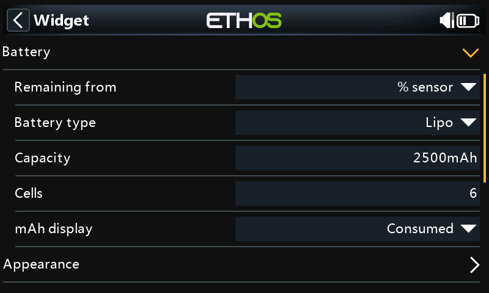

| Felt | Hva du velger |
|---|---|
| Remaining from | **Consumed mAh** bruker kapasitet minus forbruk etter batterikontrollen nedenfor. **% sensor** bruker en kilde med gjenværende prosent. **Voltage estimate** anslår lading fra pakkespenning, batteritype og celletall. |
| Battery type | Lipo, LiHV, Li-ion eller LiFe, tilsvarende batteriet. Brukes av spenningsestimat, cellemålerens skala, forbrukskontroll, full-pack KV-skala og batterietikett. |
| Capacity | Batteriets kapasitet i mAh. Brukes også av **mAh display / Remaining** når batteriprosenten kommer fra en annen metode. |
| Cells | Antall celler i serie. Brukes av batterietikett, gjennomsnittlig cellevolt, forbrukskontroll, spenningsestimat og full-pack KV-skala. |
| mAh display | **Consumed** viser valgt forbruksavlesning. **Remaining** viser kapasitet minus godkjent forbruk. Denne separate mAh-visningen trenger **Consumed mAh**-telemetri også ved de to andre prosentmetodene. |

Med et kontrollert batteri på 2500 mAh og 650 mAh forbrukt blir gjenstående kapasitet 1850 mAh,
altså 74%. Sett opp forbrukssensorens nullstilling for hvert nytt eller oppladet
batteri; VoltDeck nullstiller ikke sensoren.

**Voltage estimate** er omtrentlig og påvirkes av belastning og spenningsfall.
**% sensor** trenger en kilde som faktisk gir gjenværende lading fra 0 til 100%.
En spenningskilde blir ikke omregnet til prosent bare ved å velges her.

Et uventet fall i forbrukstelleren gjør beregnet gjenværende kapasitet ukjent.
Kontroller faktisk lading og mAh-avlesning før du bruker
**Accept battery counter...**, beskrevet under [Widgetmenyen](#widgetmenyen).
Kort telemetribortfall eller dearming godtar ikke et tellerreset automatisk.

Med **% sensor** eller **Voltage estimate** beskytter denne resetsperren fortsatt
den valgfrie **mAh display / Remaining**. Godkjenning krever en gyldig faktisk
ARM-kilde AV, gyldig forbrukt mAh og aktuell pakkespenning når en spenningskilde
er valgt. Den påvirker bare gjenværende mAh; hovedprosenten følger fortsatt
valgt metode.

Hvis ESC-en starter på **0 mAh** hver gang modellen slås på, mangler avlesningen
forbruket fra tidligere turer med samme batteri. Ved flere turer uten lading
trengs en forbrukskilde som beholder dette forbruket. En kalkulert ETHOS-sensor
kan brukes; kontroller nullstillingsvalgene og prøv at totalen beholdes når
modellen slås av og på. Nullstill den bare ved nytt eller oppladet batteri.

### Kontroll før gjenværende lading vises

Med **Remaining from = Consumed mAh** viser radiooppstart eller oppdaget
batteribortfall **CHECKING PACK**, **-- %** og tomme batterisegmenter inntil
avlesningene er kontrollert. Gjenværende mAh er også ukjent under kontrollen;
**Consumed** kan fortsatt vise sensorens avlesning. Kontrollen gjelder ved alle
forbruksnivåer, ikke bare når telleren er nær null.

Hold motoren dearmert og la batteriet stabilisere seg. VoltDeck trenger gyldig
pakkespenning, strøm og forbrukt mAh, fulgt av **10 sekunder med stabile
avlesninger ved lav strøm**. Strømmen må være mellom null og **kapasitet / 20000 A**,
begrenset til **0,5 A**: for 2500 mAh er grensen **0,125 A**. Spenningen kan variere
med høyst **0,01 V per celle** i dette tidsrommet. Høyere strøm eller ARM PÅ
avbryter målevinduet og krever minst **60 sekunder** for stabilisering før ny
kontroll. En valgt faktisk **Arm switch** må være gyldig og AV. Tomt felt eller
**Always on** gir ingen ARM-indikasjon; sørg selv for at motoren er sikkert
deaktivert.

Kontrollen sammenligner tellerens gjenværende prosent med en grov
spenningsreferanse for valgt batteritype. Avviket måles i **prosentpoeng**, i
begge retninger.
Dialogen avrunder avviket opp til nærmeste 0,1 prosentpoeng; trekker du de to
avrundede prosentene fra hverandre, kan resultatet derfor bli 0,1 poeng lavere.

| Avvik | Resultat |
|---|---|
| 10 prosentpoeng eller mindre | Godtas automatisk; beregnet prosent og batterisegmentene vises. |
| Over 10, til og med 20 prosentpoeng | **CHECK PACK/COUNTER** beholdes i rødt og gjenværende lading er ukjent. Kontroller batteri og sensor, og bruk **Accept battery counter...** for å lese begge prosentene og avviket før bekreftelse. |
| Over 20 prosentpoeng | Gjenværende lading forblir ukjent. Rett lading, batteriinnstillinger eller forbruksavlesning; menyen kan ikke omgå denne grensen. |

For **LiFe** gir spenning ingen pålitelig prosentvis sammenligning.
Etter samme lavstrømskontroll må du kontrollere faktisk lading, kapasitet og
forbrukt mAh og bekrefte med **Accept battery counter...**. Denne batteritypen
har ingen beregnet spenningsprosent eller avviksverdi å godkjenne.

Godkjenningen gjelder denne batteritilkoblingen. Under flyging bruker VoltDeck
telleren uten å gjenta spenningssammenligningen, slik at spenningsfall under
belastning ikke trekker godkjenningen tilbake. Et tellerreset krever fremdeles
eksplisitt godkjenning. Sammenhengende bortfall av **Pack voltage** i **Pack loss
delay**, også ved bortfall av all modelltelemetri, krever ny kontroll. Omstart
av radioen eller endring av batterikilder, kapasitet, celletall eller type gir
også ny kontroll. Retur etter et langt opphold i widgetens batteriavlesninger
kan også kreve ny kontroll. Kortere gap beholder godkjenningen, men manglende
aktuell spenning eller forbruk viser fortsatt ukjent lading.

Dette er en plausibilitetskontroll ved stabil, lav belastning, ikke en måling
av lading etter full hvile. De separate referansene bruker [STs OCV-tabeller
for 4,20 V og 4,35 V](https://github.com/st-sw/STC3115GenericDriver/blob/master/Docs/Config/STC3115%20OCV%20curve%20-%20default%20register%20values.pdf)
for henholdsvis Lipo/Li-ion og LiHV. Temperatur, alder, selve batteriet og
gjenværende belastning påvirker resultatet. Visningen **Voltage estimate**
beholder sin eksisterende skala, også **3,57 V = 30%** for Lipo; den er ikke
referansen for denne kontrollen.

**CHECK CELLS/TYPE** betyr at spenningen overstiger full cellevolt for valgt
batteritype med mer enn 0,15 V/celle under samme tomgangsbetingelser. Rett
**Cells**, **Battery type** eller spenningskilden; varselet kan ikke godtas bort
med tellermenyen. Totalspenningen kan ikke fastslå riktig celletall.

Kontroller batteriet og sensoren før du godtar en teller. **Ikke godta 0 mAh på
et delvis brukt batteri**: gjenopprett korrekt akkumulert forbruk, sett inn et
oppladet batteri eller velg **Voltage estimate** med begrensningene det har.
Kontrollen kan ikke gjenfinne manglende forbruk eller verifisere en feil strømkilde.
**Kontroller at batteriet er fulladet før hver flyging.** Sammenlign rapportert
forbruk i mAh med det laderen fyller tilbake over flere turer, til samme
ladenivå hver gang. Undersøk systematiske forskjeller og følg ESC-produsentens
kalibreringsanvisning dersom dette støttes; for eksempel har
[Scorpion Tribunus II Current Sensitivity Gain](https://www.scorpionsystem.com/files/download/Tribunus%20II%20Instructions%20-%20220922.pdf).
En bestått kontroll garanterer ikke en bestemt reserve ved landing.

<table>
<tr>
<td>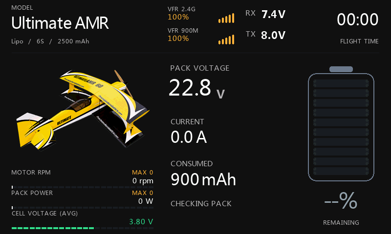 <b>Checking pack</b> Gjenværende lading er ukjent under kontrollen ved stabil, lav strøm.</td>
<td>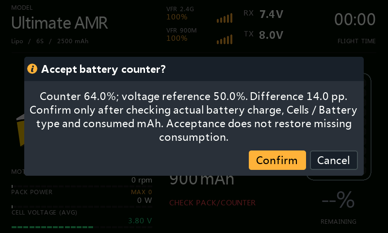 <b>Manuell bekreftelse</b> Les begge estimatene og avviket før du godtar telleren.</td>
</tr>
<tr>
<td>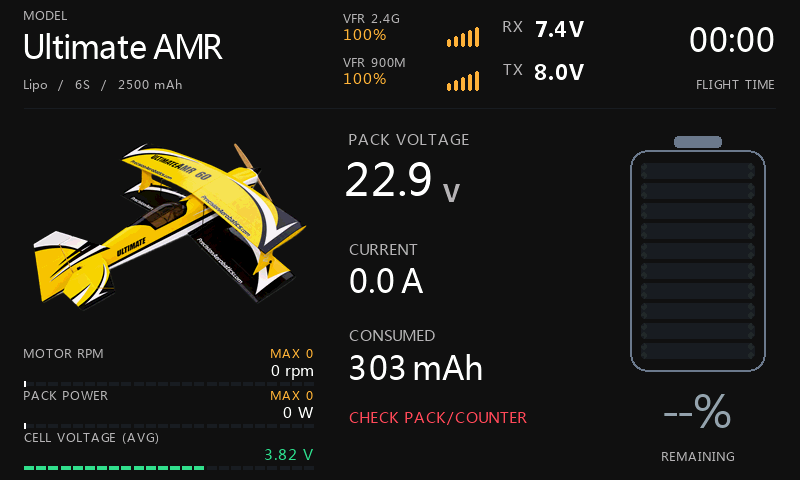 <b>Check pack/counter</b> 6S Lipo ved 22,9 V, 303 mAh og 0 A: gjenværende lading er ukjent.</td>
<td>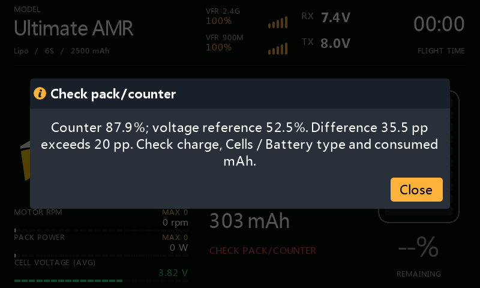 <b>Over 20 prosentpoeng</b> Dialogen forklarer spriket; det kan ikke godkjennes.</td>
</tr>
<tr>
<td colspan="2">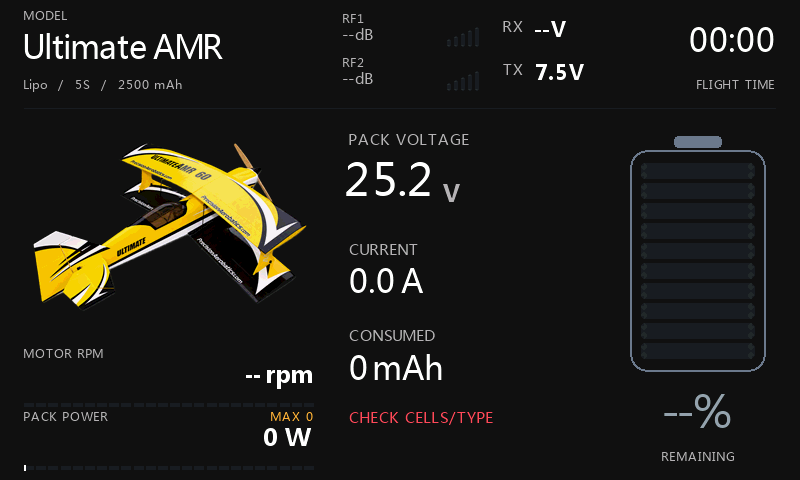 <b>Check cells/type</b> 25,2 V med 5S valgt: rett batterioppsettet.</td>
</tr>
</table>

## 2. Appearance

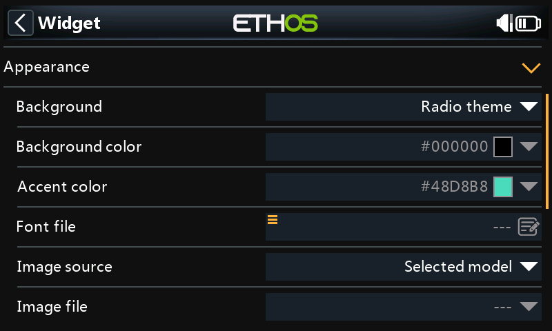

| Felt | Hva det endrer |
|---|---|
| Background | **Radio theme** følger ETHOS-fargene; **Black** gir svart bakgrunn; **Custom** bruker din bakgrunnsfarge. |
| Background color | Aktivt med **Custom**. |
| Accent color | Aktivt med **Black** eller **Custom**. **Radio theme** bruker temaets aksentfarge. |
| Font file | Valgfri fontsti. La feltet være tomt for radioens innebygde fonter. |
| Image source | **Selected model** gjenbruker modellbildet; **Image file** velger et separat bilde; **Hidden** skjuler det. |
| Image file | Aktivt med **Image file**. Velg bilde fra `/bitmaps/models`. |

Bruk vanlig **8-bit RGB eller RGBA PNG**. **290 × 191** passer bildefeltet;
**480 × 272** og **480 × 320** støttes også. Sideforholdet beholdes.
Grensen er 160 000 piksler, så **800 × 480** er for stort. Indekserte/palettbilder
og PNG med 16-bit fargekanaler støttes ikke. Gjennomsiktighet lar bakgrunnen
synes gjennom.

Eksempelbildet [Ultimate AMR](images/ultimate-amr.png) er 290 × 191;
se [NOTICE](../NOTICE.md) for bruksvilkår.

## 3. Battery alert

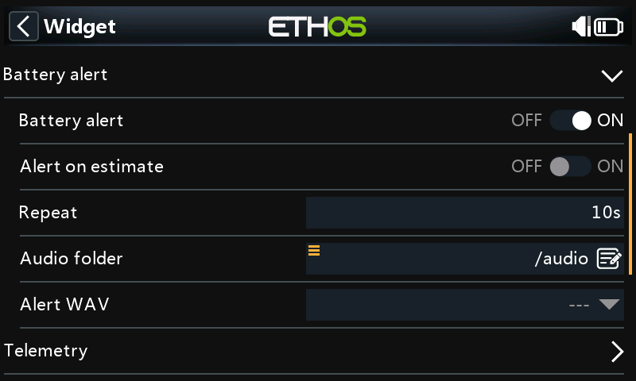

| Felt | Funksjon |
|---|---|
| Battery alert | Slår på widgetens batterilyd ved **30% eller lavere**. |
| Alert on estimate | Aktivt når varsling er på og **Remaining from = Voltage estimate**. Tillater lydvarsel basert på det omtrentlige spenningsestimatet. |
| Repeat | Minstetid mellom varsler, i sekunder. Aktivt når varsling er på. |
| Audio folder | Mappe for lydvelgeren, normalt `/audio`. Aktivt når varsling er på. Endre mappen og åpne konfigurasjonen på nytt før du velger fil. |
| Alert WAV | Aktivt når varsling er på. Velg PCM WAV: **32 kHz, mono, 16-bit**. Manglende eller ugyldig fil gir en tone. |

Neste varsel venter til valgt lyd er ferdig. Kort tilbakekomst eller manglende
avlesninger starter ikke venteintervallet på nytt. Preview spiller ikke varsler.
Disse valgene endrer ikke ETHOS sine egne telemetrialarmer.

## 4. Telemetry

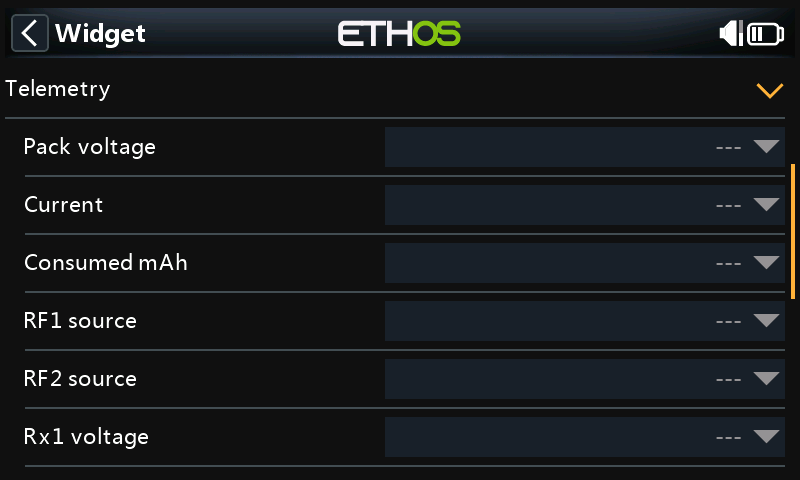

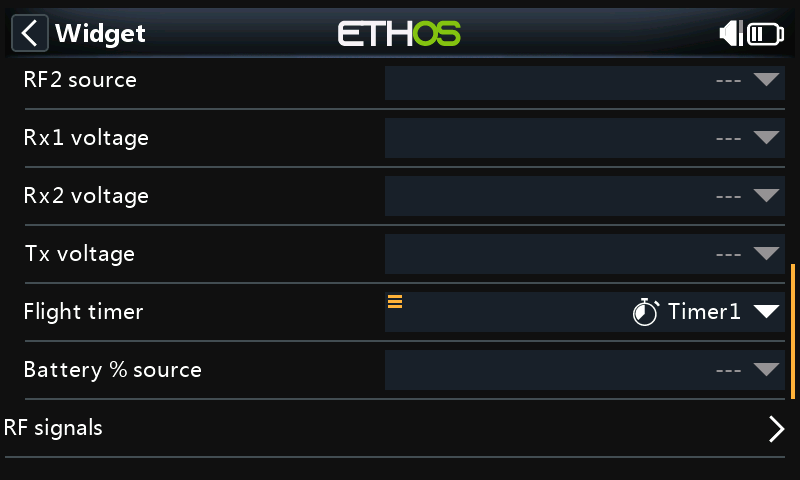

Velg målekilder fra **Telemetry**, og en ETHOS-timer til **Flight timer**.
Liknende sensornavn kan ha forskjellige enheter.

| Felt, i menyrekkefølge | Måling og bruk |
|---|---|
| Pack voltage | Hele motorbatteriets spenning i **V**; **mV** omregnes til V. Brukes på hovedskjermen, til Watt, gjennomsnittlig cellevolt, spennings-/KV-estimat og batteriøkter. |
| Current | Motorbatteriets strøm i **A**; **mA** omregnes til A. Brukes på hovedskjermen, til Watt, høyeste strøm i flyloggen og innledende batterikontroll. |
| Consumed mAh | Akkumulert forbruk siden batteriet ble ladet, i **mAh**; **Ah** omregnes til mAh. Brukes av mAh-visning og forbruksbasert gjenværende kapasitet. Feltet er aktivt ved alle batterimetoder. |
| RF1 source | RSSI i **dB**, eller VFR/signalkvalitet i **%**, på første RF-plass. |
| RF2 source | RSSI i **dB**, eller VFR/signalkvalitet i **%**, på andre RF-plass. |
| Rx1 voltage | Første mottakerbatteris spenning i **V** eller **mV**. |
| Rx2 voltage | Andre mottakerbatteris spenning i **V** eller **mV**, dersom det finnes. |
| Tx voltage | Senderspenning i **V** eller **mV**. Tomt felt bruker radioens egen batterikilde. |
| Flight timer | En ETHOS-timer som gir sekunder. Denne timeren på hovedskjermen er uavhengig av flyloggens opptjente kvalifiseringstid. |
| Battery % source | Gjenværende lading i **%**, fra 0 til 100. Aktivt bare med **Remaining from = % sensor**. |

Bruk helst kilder med riktig ETHOS-enhet. Rå tallkilder for spenning, strøm,
forbruk og RPM må allerede gi henholdsvis V, A, mAh og rpm; enhetsteksten
skalerer ikke verdien. For **Battery % source** må en rå kilde ha eksplisitt
`%`-enhetstekst og gyldig verdi fra 0 til 100.
RF-kilder må ha ETHOS-enheten dB eller %; enhetstekst på en rå kilde er ikke nok.
Den innledende batterikontrollen krever faktiske ETHOS-enheter V/mV og A/mA.
Råkilder for spenning og strøm kan fortsatt brukes til vanlig visning, men kan
ikke godkjenne gjenværende lading fra **Consumed mAh**.

Manglende eller avviste målinger vises som **--**. Det betyr ikke null forbruk
eller fullt batteri. En inaktiv valgt RF-kilde beholder navn og enhet; andre
RF-enheter avvises. Radioens batteri og timer kan fortsatt være tilgjengelige
når modelltelemetrien er borte.

## 5. RF signals

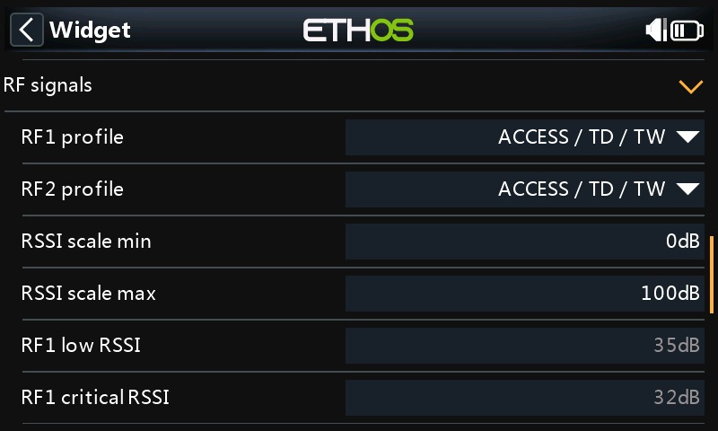

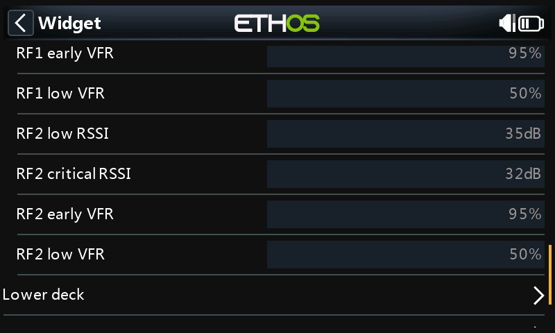

| Felt, i menyrekkefølge | Funksjon |
|---|---|
| RF1 profile | **ACCESS / TD / TW**, **ACCST** eller **Custom**, for første RF-plass og dens flygraf. Velg protokollen, ikke bare etter frekvensen i sensornavnet. |
| RF2 profile | Samme valg for andre RF-plass og dens flygraf. |
| RSSI scale min | Nedre ende av RSSI-måler/-graf, i dB. |
| RSSI scale max | Øvre ende av RSSI-måler/-graf, i dB; må overstige minimum. VFR bruker alltid 0–100%. |
| RF1 low RSSI | Gul RSSI-grense i dB for plass 1; aktivt med **RF1 profile = Custom**. |
| RF1 critical RSSI | Rød RSSI-grense i dB for plass 1; aktivt med **Custom**. |
| RF1 early VFR | Gul VFR-grense i % for plass 1; aktivt med **Custom**. |
| RF1 low VFR | Rød VFR-grense i % for plass 1; aktivt med **Custom**. |
| RF2 low RSSI | Gul RSSI-grense i dB for plass 2; aktivt med **RF2 profile = Custom**. |
| RF2 critical RSSI | Rød RSSI-grense i dB for plass 2; aktivt med **Custom**. |
| RF2 early VFR | Gul VFR-grense i % for plass 2; aktivt med **Custom**. |
| RF2 low VFR | Rød VFR-grense i % for plass 2; aktivt med **Custom**. |

Velg **Custom** før du endrer grensene for den plassen. Både dB- og %-grensene
er tilgjengelige fordi hovedskjerm og graf kan bruke ulike typer RF-kilde.

| Profil | RSSI gul / rød | VFR gul / rød |
|---|---|---|
| ACCESS / TD / TW | ≤35 / ≤32 dB | ≤95 / ≤50% |
| ACCST | ≤45 / ≤42 dB | ≤95 / ≤50% |
| Custom | Dine grenser for plassen | Dine grenser for plassen |

Dette er visuelle grenser. De setter ikke radioens alarmer;
95% er VoltDecks tidlige VFR-markering, ikke en ETHOS-alarmgrense.

## 6. Lower deck

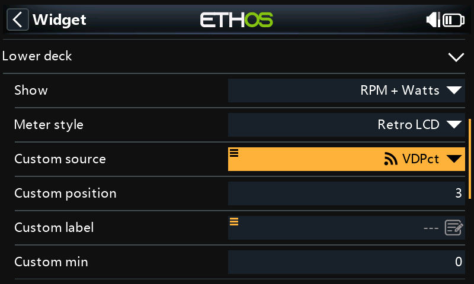

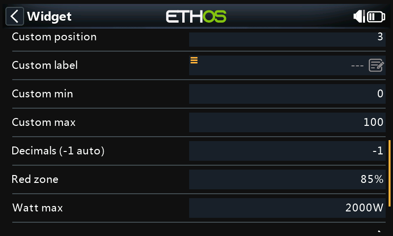

| Felt | Funksjon |
|---|---|
| Show | **Only Custom**, **RPM**, **Watts**, **Cell volts**, **Voltage estimate**, **RPM + Watts**, **RPM + W + cell** eller **Hidden**. En valgt Custom-kilde legger til en rad i visningen. |
| Meter style | **Numeric** gir tall; **Retro LCD** gir tall med segmentert måler. Inaktivt med **Hidden**. |
| Custom source | En egnet tallkilde, tilgjengelig når Show ikke er **Hidden**. Enheten kommer fra kilden. Velg **---** for å fjerne den ekstra raden. |
| Custom position | Plass **1**, **2** eller **3**, regnet ovenfra. Aktivt når en Custom-kilde vises sammen med andre verdier. Med færre rader blir en plass etter siste rad satt sist. |
| Custom label | Aktivt når Custom er med i visningen. Tomt felt bruker kildenavnet. |
| Custom min | Målerens nedre grense; aktivt når Custom er med i **Retro LCD**. |
| Custom max | Målerens øvre grense; aktivt når Custom er med i **Retro LCD**. Må overstige minimum. |
| Decimals (-1 auto) | Aktivt når Custom er med. **-1** følger kildens desimaler; 0–3 velger fast antall. |
| Red zone | Starten på rødt område, som prosent av målerens skala, for **RPM**, **Watts** og **Custom** med **Retro LCD**. Cell volts og Voltage estimate bruker batterigrenser i stedet. |
| Watt max | Øvre grense i W, aktivt når **Watts** inngår i en **Retro LCD**-visning. |

Watt beregnes fra **Pack voltage × Current**, uten behov for en egen effektsensor.
Det er elektrisk tilført effekt. Cellevolt er **Pack voltage ÷ Cells**;
gjennomsnittet kan ikke avsløre en svak enkeltcelle. Spenningsestimatet nederst
kan vises samtidig som hovedbatteriets prosent beregnes fra forbruk.

### Eksempel: turtall, effekt og ESC-temperatur

Sett **Show = RPM + Watts**, velg ESC-ens temperatursensor som **Custom source**,
og sett **Custom position = 3**. Da vises RPM, Watts og ESC-temperatur.
Temperaturkilden bør ha °C som enhet; målergrensene kan for eksempel være
0–100 °C. Grensene setter bare skalaen, ikke en temperaturalarm.
**Only Custom** viser bare denne kilden.

| Custom position | Rad 1 | Rad 2 | Rad 3 |
|---|---|---|---|
| 1 | Custom | RPM | Watts |
| 2 | RPM | Custom | Watts |
| 3 | RPM | Watts | Custom |

Nedre visning har maksimalt tre rader. Med **RPM + W + cell** erstatter en valgt
Custom-kilde celleraden. Fjernes Custom-kilden, kommer celleraden tilbake.
En valgt kilde beholder raden ved telemetribortfall og viser ukjent verdi til
målingene kommer tilbake.

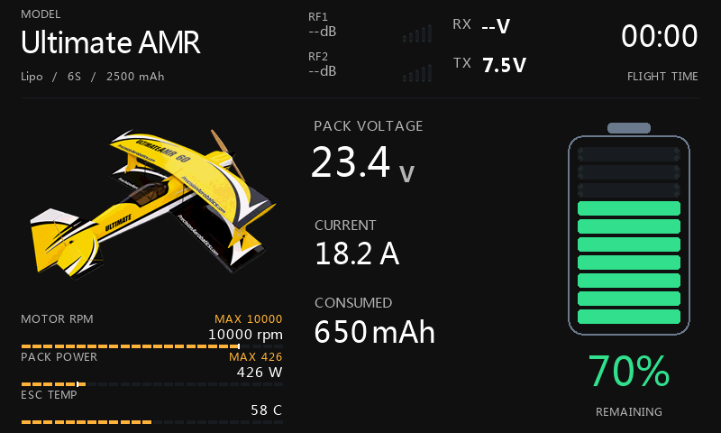

### Cellevolt: skala og farger

**Cell volts** har en fast skala for valgt batteritype, i stedet for å starte på
null. Både tallet og de fylte målersegmentene følger cellespenningen. Verdier
på eller under nedre grense, og over øvre grense, er røde.

| Battery type | Målerskala, V/celle | Nedre rødgrense, V/celle | Øvre grense, V/celle |
|---|---|---|---|
| Lipo | 3,27–4,20 | 3,57 | 4,20 |
| LiHV | 3,37–4,35 | 3,685 | 4,35 |
| Li-ion | 2,97–4,20 | 3,36 | 4,20 |
| LiFe | 2,77–3,65 | 3,055 | 3,65 |

For Lipo er celleverdien oransje over 3,57 til og med 3,615 V, gul over 3,615
til og med 3,66 V, og grønn over 3,66 til og med 4,20 V. Andre typer bruker de
samme 30/35/40%-grensene i sitt eksisterende lineære spenningsestimat.
Hovedbatteriets prosent følger valgt beregningsmetode og avrundes til heltall;
fargen kan derfor avvike fra celleverdien nær en grense.
Cellefargen følger uavrundet spenning: en vist verdi på 4,20 V kan ligge litt
over 4,20 V og derfor være rød.

Dette er omtrentlige visningsgrenser, ikke en måling av faktisk lading.
Lipo-estimatet beholder **3,57 V = 30%**; belastning og spenningsrestitusjon
påvirker målingen. LiHV har **4,35 V** som øvre grense, i samsvar med
[Tattus LiHV-veiledning](https://www.genstattu.com/content/instock/LiHv-Manual.pdf).
Følg alltid batteriprodusentens merkede grenser, også for LiFe.
Gjennomsnittet som vises kan ikke fastslå om hver enkeltcelle er innenfor
sine grenser.

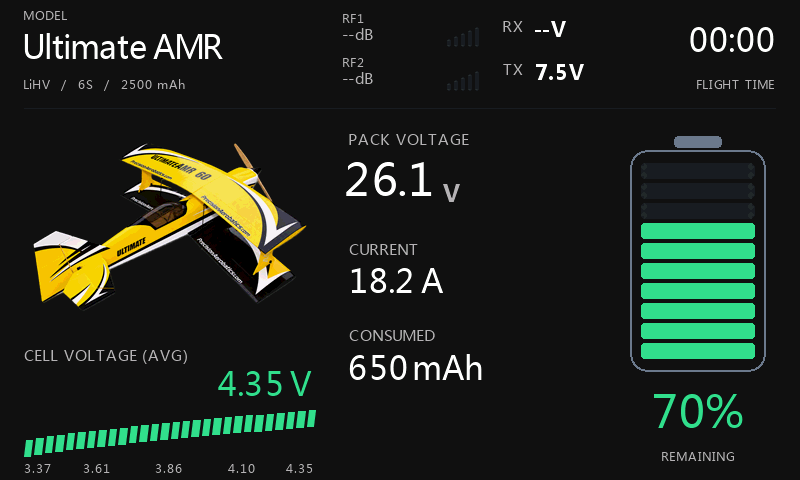

## 7. Motor / RPM

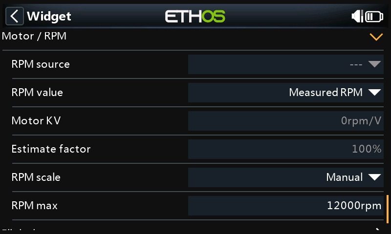

| Felt | Funksjon |
|---|---|
| RPM source | Faktisk mekanisk turtall i **rpm** (ETHOS kan vise **r/m**). Aktivt for målt RPM nederst eller når logging er på. Flyloggen beholder målt RPM også når hovedskjermen viser et estimat. |
| RPM value | **Measured RPM** eller **KV x volts (est.)**. Aktivt når nedre visning inkluderer RPM. |
| Motor KV | Motorens KV i rpm/V. Brukes av KV-estimat, **Full-pack KV**-skala og flyloggens KV-potensial. Logging holder feltet aktivt også uten RPM nederst. |
| Estimate factor | 10–100%, aktivt ved KV-estimert RPM-visning. Standard 100% viser friløpspotensial; velg en lavere faktor bare ut fra målinger av eget motor-/propelloppsett. |
| RPM scale | **Manual** eller **Full-pack KV**, aktivt for en RPM-måler med **Retro LCD**. Sistnevnte gir fast fulladet skala ut fra batteritype, celletall og KV. |
| RPM max | Manuell skalagrense i rpm. Tilgjengelig som reservegrense dersom **Full-pack KV** mangler gyldig KV-verdi. Aktivt bare for den aktuelle RPM-skalaen i **Retro LCD**. |

KV × aktuell pakkespenning beregner et elektrisk turtallspotensial.
Det måler ikke akselturtallet. Visningen er merket **RPM ESTIMATE**.
Faktoren gjelder estimert visning; flyloggens **KV potential** er uten denne
korreksjonen.

## 8. Flight log

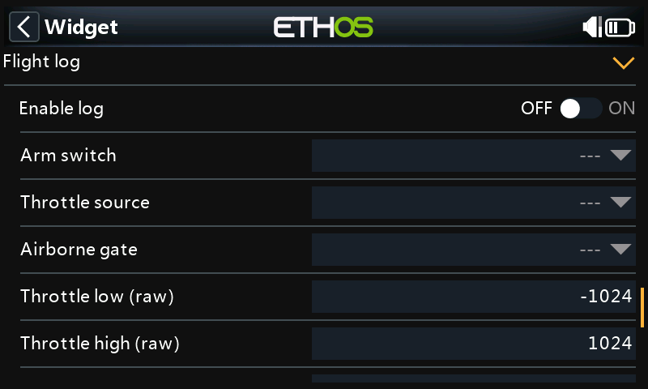

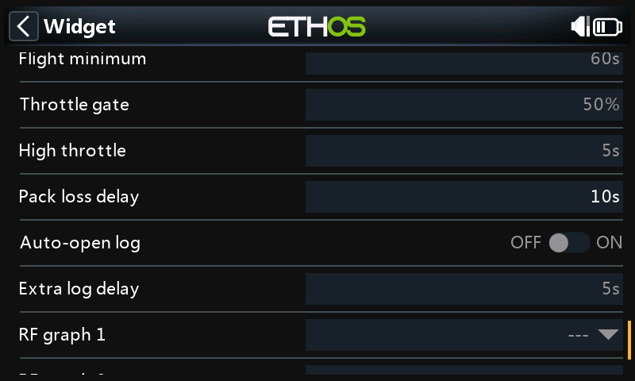

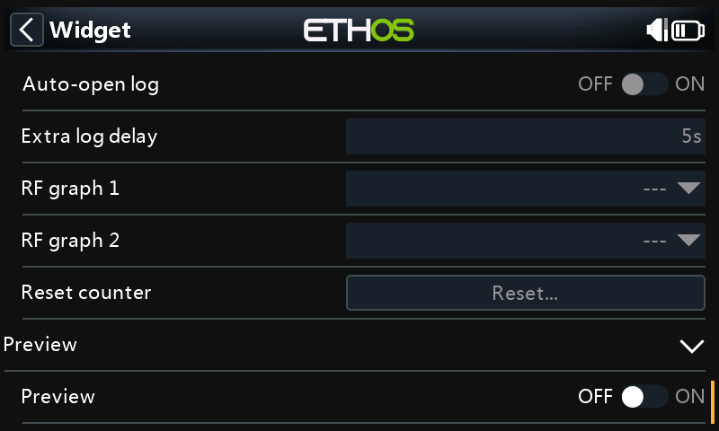

| Felt, i menyrekkefølge | Funksjon |
|---|---|
| Enable log | Slår på kvalifisering og modellspesifikk flytelling. |
| Arm switch | Motorens faktiske arm-bryter eller logiske betingelse. Kreves for logging; aktivt også med logging av. Når valgt må den være gyldig og AV ved batterikontroll og tellergodkjenning. **---** og **Always on** gir ingen ARM-indikasjon for denne kontrollen. |
| Throttle source | Faktisk gasskontroll/-kanal. Aktivt for diagnostikk også med logging av. |
| Airborne gate | Valgfri bryter/logisk betingelse som må være PÅ for opptjening av kvalifiseringstid. **---** og **Always on** passerer. Aktivt for diagnostikk. |
| Throttle low (raw) | Råverdi ved null gass, vist i **Flight diagnostics**. Standard -1024. |
| Throttle high (raw) | Råverdi ved full gass. Standard 1024; må overstige nedre endepunkt. Begge endepunktene er aktive for diagnostikk. |
| Flight minimum | Minst opptjent kvalifiseringstid; standard 60 s. Aktivt med logging på. |
| Throttle gate | Normalisert gassgrense; standard 50%. Aktivt med logging på. |
| High throttle | Opptjent tid ved/over gassgrensen; standard 5 s. Aktivt med logging på. |
| Pack loss delay | Sammenhengende bortfall av gyldig, positiv **Pack voltage** før økten avsluttes; standard 10 s, område 3–120 s. Alltid aktivt fordi det også krever ny batterikontroll og tillater ny forbruksavlesning etter batteribortfall. |
| Auto-open log | Åpner loggen etter en kvalifisert økt. Aktivt med logging på; standard Av. |
| Extra log delay | Ekstra ventetid etter **Pack loss delay**; standard 5 s, område 0–120 s. Aktivt når logging og automatisk åpning er på. |
| RF graph 1 | Valgfri RSSI-kilde i **dB** eller VFR-kilde i **%** for graf 1; tomt felt bruker **RF1 source**. Aktivt med logging på. |
| RF graph 2 | Samme for graf 2; tomt felt bruker **RF2 source**. Aktivt med logging på. |
| Reset counter | Aktivt med logging på. **Reset...** åpner bekreftelse. Dearm og koble fra batteriet lenge nok til at økten avsluttes først. Bekreftelse nullstiller modellens teller og fjerner beholdt logg. |

Les gassendepunktene i **Flight diagnostics**, ikke bare prosentene i
kanalmonitoren. Kilder kan bruke -1024/+1024, -100/+100 eller 0/100.
VoltDeck omregner valgt område til 0–100%; midtstilling kan derfor være 50%
selv om kanalmonitoren viser 0%.

Kvalifisering krever ARM PÅ, gyldig gass og pakkespenning, godkjent airborne gate
og begge tidskravene. Sekundene over gassgrensen summeres.
En armert benktest kan kvalifisere; en airborne-betingelse kan filtrere bedre,
men beviser ikke at modellen flyr. Slå av logging ved benkarbeid som ikke skal
telles.

### En økt per batteritilkobling

Dearming eller airborne gate AV pauser opptjent tid. Rearming med samme
tilkoblede batteri fortsetter samme logg; økten kan telles bare én gang.
RF-historikken fortsetter gjennom pausene, mens opptjent flytid stopper.

Bare sammenhengende pakkebortfall i **Pack loss delay** avslutter økten.
Spenning tilbake før fristen lar økten fortsette. Positivt spenningsfall avslutter
ikke økten. Langt telemetribortfall kan ligne frakobling, mens et batteribytte
raskere enn forsinkelsen kan bli oversett.

Siste kvalifiserte logg beholdes etter at modellen slås av og mens neste flyging
kvalifiseres. En avvist kandidat erstatter den ikke. Flytelleren lagres per modell;
siste statistikk og grafer forsvinner ved omstart av radioen.

### Automatisk åpning av flylogg

Med **Pack loss delay = 10 s** og **Extra log delay = 5 s** åpnes loggen omtrent
15 s etter sammenhengende pakkebortfall. Bare en ny, avsluttet og kvalifisert økt
utløser byttet. Spenning tilbake, modellbytte, logging/auto-open av, preview,
konfigurasjon eller manuelt visningsbytte avbryter ventende åpning.
Den skjer én gang for flygingen, inne i VoltDecks gjeldende widgetfelt.

### Flight diagnostics

Widgetmenyens valg viser rå/beregnet gass, endepunkter, ARM, airborne gate,
pakkespenning og fremdrift mot begge tidskravene. Les statuslinjen sammen med
de enkelte vilkårene. **LOG DISABLED** betyr at logging er av selv om øvrige
vilkår passerer. Diagnostikken endrer ikke radioens sikkerhetsfunksjoner.
Hold motoren sikkert deaktivert mens du kontrollerer gassendepunkter.

## 9. Preview

**Preview** gir eksempelverdier for å se på utformingen. Det teller ikke flyginger,
spiller ikke varsler og endrer ikke reelle forbrukssperrer eller maksimumsverdier.
Slå det av før kontroll av modelltelemetri eller godkjenning av forbruksteller.

Preview beholder et godkjent batteri når reell telemetri fortsetter. Et faktisk
bortfall av batterispenning i **Pack loss delay** under Preview krever ny kontroll
når du går tilbake til aktuelle avlesninger.

## Widgetmenyen

| Menyvalg | Resultat |
|---|---|
| Configure widget | Åpner gruppene ovenfor. |
| Flight log / Dashboard | Bytter mellom hovedvisning og flylogg. |
| Flight diagnostics | Åpner kvalifiseringsstatus og aktuelle kontrollavlesninger. |
| Reset live peaks | Nullstiller hovedskjermens RPM- og Watt-maksimum. Endrer ikke flyteller eller maksimum i registrert flylogg. |
| Accept battery counter... | Viser [batterikontrollen](#kontroll-før-gjenværende-lading-vises) ved **Consumed mAh**, eller et reset av den valgfrie telleren for gjenværende mAh med en annen metode. Kontroller faktisk lading og sensor før bekreftelse. Den kan ikke omgå avvik over 20 prosentpoeng eller **CHECK CELLS/TYPE** i batterikontrollen. Godkjenning gjenoppretter ikke manglende forbruk, nullstiller ikke sensoren, fyller ikke batteriet og endrer ikke flytellingen. |

## Visningseksempler

### RPM, Watt og gjennomsnittlig cellevolt

<table>
<tr>
<td> <b>RPM / Retro LCD</b> Measured RPM, Manual, RPM max 12000.</td>
<td> <b>RPM + Watts / Retro LCD</b> Watt max 1600 W.</td>
</tr>
<tr>
<td> <b>RPM + W + cell / Retro LCD</b></td>
<td> <b>RPM / Numeric</b></td>
</tr>
<tr>
<td> <b>Watts / Retro LCD</b></td>
<td> <b>Cell volts / Numeric</b> Custom bakgrunn; mAh display Remaining.</td>
</tr>
</table>

22,8 V × 38,6 A gir omtrent **880 W** elektrisk tilført effekt.
21,8 V ÷ 6 celler gir **3,63 V** gjennomsnittlig cellevolt.
Manglende spenning/strøm vises med streker fremfor oppdiktet effekt.

### Valgfri telemetri og KV-estimat

Velg **Custom**, en temperaturkilde, etiketten **ESC TEMPERATURE**, område
0–100 og 0 desimaler. Den faktiske temperaturenheten kommer fra kilden.

Eksemplet bruker **RPM / Retro LCD**, **KV x volts (est.)**, 420 KV,
illustrativ faktor 85% og **Full-pack KV**. Ved 22,8 V blir det
420 × 22,8 × 0,85 ≈ **8140 rpm**. Med 6S Lipo blir fast skala
420 × 6 × 4,20 = 10584, avrundet opp til **11000 rpm**.
85% er et eksempel, ikke en generell korreksjon for propellbelastning.

### Batterifarger

| Gjenværende lading | Farge |
|---|---|
| Over 40% | Grønn |
| Over 35%, til og med 40% | Gul |
| Over 30%, til og med 35% | Oransje |
| 30% eller lavere | Rød |

<table>
<tr>
<td> <b>40%: gul</b></td>
<td> <b>35%: oransje</b></td>
</tr>
</table>

### VFR-grafer i stedet for RSSI

Hovedskjermens **RF1/RF2 source** kan vise RSSI i dB, mens **RF graph 1/2**
viser VFR i %. Dette er ulike målinger. Velg grafkilder før flyging;
hver økt beholder kildene, navnene og enhetene fra starten.
Visuelle profiler kan fortsatt justeres. Manglende data gir brudd i kurven;
korte fall beholdes. Sanntidsgrafen kan ligge noen sekunder etter.

RSSI-eksemplet bruker **ACCST** med 45/42 dB som visuelle grenser.
Oppsummeringen skiller målt RPM fra KV-potensial og viser flytid,
maksimal strøm/Watt, pakkespenning lav/høy og modellens flyteller.

### Bilder av batteriøktene

| Motor dearmert, samme batteri | Batteriet frakoblet lenge nok |
|---|---|
|  |  |
| Teller 1 og samme logg beholdes. | LAST FLIGHT LOG beholdes med teller 1. |

| Neste flyging kvalifiseres | Neste flyging har kvalifisert |
|---|---|
|  |  |
| Forrige logg beholdes; telleren er fortsatt 1. | Telleren blir 2; ny logg erstatter den gamle. |

Kontroller kilder, kapasitet, celletall, forbruksreset, lyd og kontrollvilkår
for modellen før flyging. Ta sikkerhetskopi av modell og SD-kortinnstillinger,
og behold radioens egne alarmer og failsafe.
