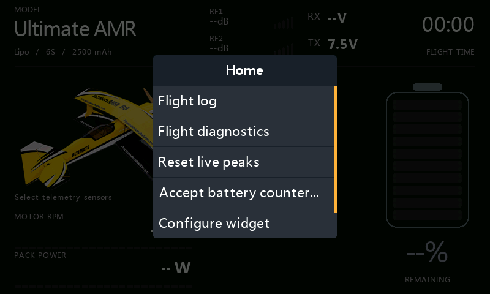
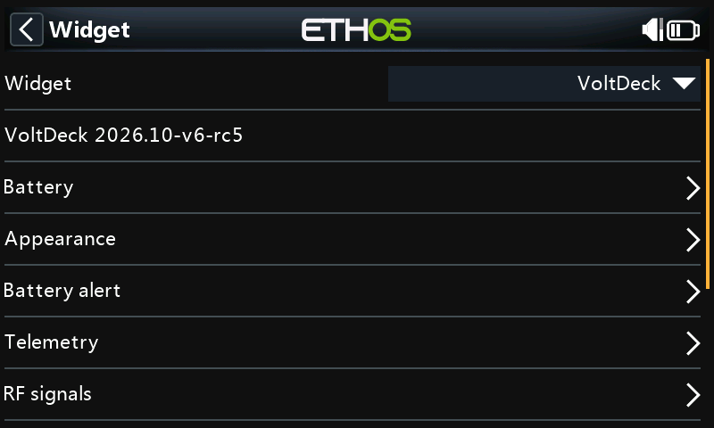
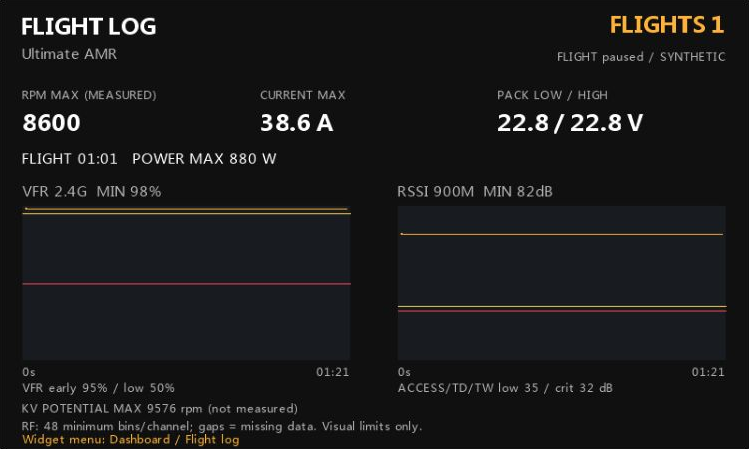
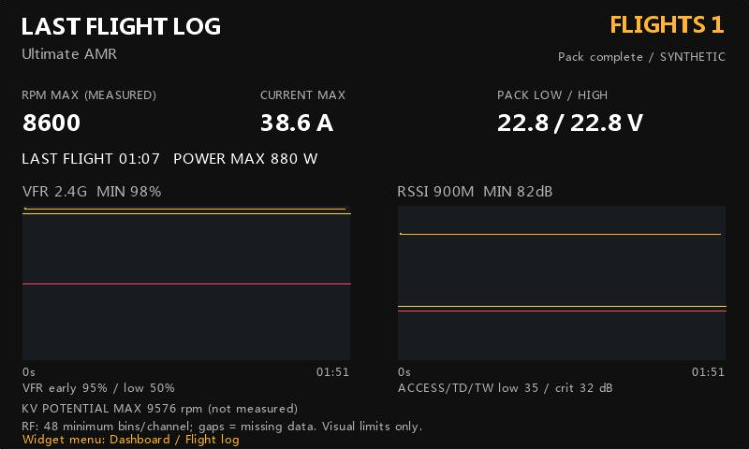
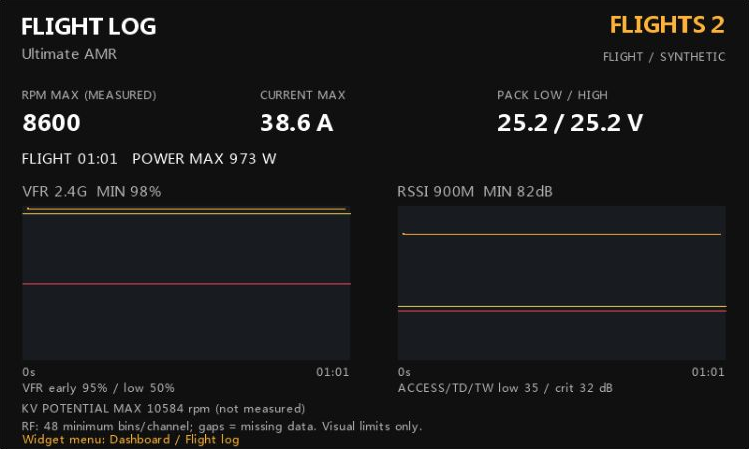
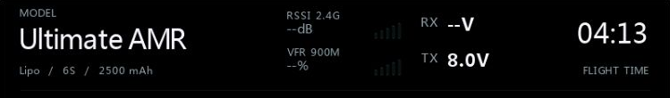
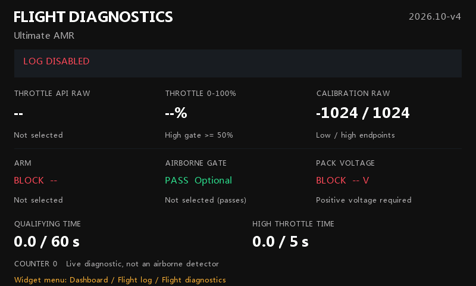
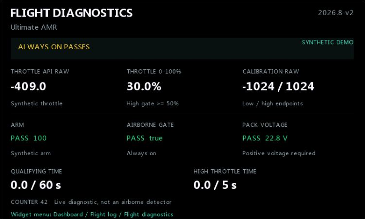

# VoltDeck: norsk hurtigguide

[Alle bilder og detaljer](Configuration.md) | [Installasjon](VoltDeck.md)

**VoltDeck har bestått test på fysisk X20RS med modell og ETHOS 26.1.2.**

Visningseksemplene bruker eksempelverdier. Meny- og konfigurasjonsbildene viser
widgeten i ETHOS.

## Installasjon og grunnoppsett

1. Last ned [VoltDeck-2026.10-v5.zip](https://github.com/bliatun-code/VoltDeck/releases/download/voltdeck-2026.10-v5/VoltDeck-2026.10-v5.zip) fra release-siden.
2. Pakk ut `scripts/VoltDeck` til SD-kortet, slik at filen ligger som `scripts/VoltDeck/main.lua`.
3. Ved oppdatering: fjern eventuell `scripts/VoltDeck/main.luac`, slik at ETHOS bruker den nye `main.lua`.
4. Start ETHOS på nytt og velg **VoltDeck** i et fullskjerms widgetfelt.
5. Velg telemetrikildene for akkurat denne modellen.
6. Sett **Battery / Remaining from = Consumed mAh**, korrekt kapasitet og celletall.
7. Nullstill forbruksteller når du kobler til et nytt eller oppladet batteri.

Åpne widgetmenyen og velg **Configure widget** for å endre innstillinger.
Velg **Flight log** eller **Flight diagnostics** for å bytte visning.

<table>
<tr>
<td> <b>Widgetmeny</b></td>
<td> <b>Configure widget</b></td>
</tr>
</table>

Modellnavnet hentes fra valgt modell. **Appearance / Image source =
Selected model** bruker modellbildet som allerede er valgt i radioen.

## Velg visning nederst

| Visning | Lower deck / Show | Meter style |
|---|---|---|
| LCD turtall | RPM | Retro LCD |
| LCD turtall + effekt | RPM + Watts | Retro LCD |
| Turtall + effekt + cellevolt | RPM + W + cell | Retro LCD |
| Stor tallverdi | RPM, Watts eller Cell volts | Numeric |
| Valgfri sensor | Custom | Numeric eller Retro LCD |

For målt turtall: velg **Motor / RPM / RPM value = Measured RPM**, velg
**RPM source**, og sett **RPM max**, for eksempel 12000. Dette er
skalagrensen, ikke et løfte om motorens maksturtall.

For RPM + Watt: sett **Watt max**, for eksempel 1600 W. Effekten beregnes
fra pakkespenning ganger strøm. 22,8 V ganger 38,6 A gir omtrent 880 W.
Dette er elektrisk tilført effekt, ikke mekanisk effekt på propellen.

Cellevolt er pakkespenning delt på antall celler. Gjennomsnittet kan skjule
en svak enkeltcelle og erstatter ikke måling av hver celle.

## Uten RPM-sensor

Velg **RPM value = KV x volts (est.)**, oppgi motorens KV og velg gjerne
**RPM scale = Full-pack KV**. Skalaen blir fast ut fra fulladet pakke,
mens visningen følger aktuell spenning og eventuell voltage sag.

Eksemplet bruker 420 KV og en illustrativ faktor på 85%. Dette er ikke
en anbefalt standardkorreksjon for propellbelastning. Bruk egne målinger,
eller behold 100% for teoretisk friløpspotensial. Verdien er merket
**RPM ESTIMATE** og må ikke forveksles med målt turtall.

## Batteri, bakgrunn og lyd

Med 2500 mAh kapasitet og 650 mAh forbrukt blir gjenstående kapasitet
1850 mAh, altså 74%. Batteriet blir gult ved 40%, oransje ved 35% og rødt
ved 30% eller lavere. Over 40% er det grønt.

Hvis et tellerreset gjør batteriestimatet ukjent, kontroller ladingen og
mAh-avlesningen. Slå av demo, dearm motoren og velg **Accept battery counter...**
i widgetmenyen. Valget godtar avlesningen; det nullstiller ikke sensoren.

Velg **Appearance / Background = Radio theme**, **Black** eller **Custom**.
Med Custom kan du velge bakgrunnsfarge og aksentfarge. Tomt fontfelt bruker
radioens innebygde fonter.

Under **Battery alert** velger du lydfil og repetisjonsintervall.
Sett lydmappe først, åpne innstillingene igjen, og velg **Alert WAV**.
Filen må være PCM WAV, 32 kHz, mono, 16-bit. Ugyldig eller manglende fil
gir tone i stedet. Alarmen utløses ved 30% eller lavere og er deaktivert
i **Synthetic preview**.

## Valgfri telemetri

Velg **Show = Custom**, velg sensoren og sett en passende min/max-skala.
For ESC-temperatur kan for eksempel 0-100 C være en passende skala.
Enheten kommer fra sensoren. Velg en sensor som allerede finnes i modellen.

## Flylogg og RF-grafer

Åpne **Flight log** i widgetmenyen for flytid, maksimumsverdier og RF-grafer.

For logging: velg arm-betingelse og throttle-kilde. Standardfiltrene
er minst 60 sekunder og minst 50% throttle i til sammen 5 sekunder.
Still **Throttle low (raw) / high (raw)** etter verdiene fra den valgte kilden,
ikke bare prosentene i kanalmonitoren. Kilden kan bruke -1024/+1024,
-100/+100 eller 0/100; bruk endepunktene for akkurat den kilden. En passende **Airborne gate**
kan gi bedre filtrering, men en lang benktest kan likevel bli telt.

### En økt per batteritilkobling

Motor-ARM er et sikkerhets-/kvalifiseringsvilkår, ikke en nullstilling av økten.
Dearming ved inspeksjon eller touch-and-go pauser opptjent flytid og tid over
gassgrensen. Når samme pakke armeres igjen, fortsetter samme logg og telling;
en økt kan bare øke telleren én gang. Airborne gate av pauser også, uten sletting.

Økten avsluttes først når gyldig, positiv pakkespenning mangler sammenhengende
i **Pack loss delay**: standard 10 sekunder, valgbart fra 3 til 120 sekunder.
Kortere bortfall nullstiller ikke økten.
Vanlig spenningsfall under belastning, med fortsatt positiv verdi, avslutter
ikke økten. Langt RF-/telemetribortfall kan ligne frakoblet batteri; velg gjerne
30 sekunder ved behov. Et batteribytte kortere enn forsinkelsen kan bli oversett.

Siste kvalifiserte flylogg vises fortsatt etter at flyet slås av, og mens neste
flyging kvalifiseres. **LAST FLIGHT LOG** betyr at statistikken og grafene tilhører
forrige kvalifiserte flyging. Først når den nye flygingen kvalifiserer, erstattes
loggen. En kandidat som ikke kvalifiserer, sletter ikke forrige logg.
Omstart av radioen tømmer loggene; bare telleren lagres permanent.

RF-grafens tidsakse inkluderer motorpausene, mens flytiden bare øker når
arm-, gate- og telemetrivillkårene passerer. For å nullstille telleren må logging
være aktivert, motoren dearmert og pakkeøkten avsluttet etter frakobling.

### Automatisk flylogg

Under **Flight log** kan **Auto-open log** slås på (standard Av).
**Extra log delay** er ekstra ventetid etter **Pack loss delay**:
standard 5 s, valgbart 0-120 s. Med 10 s + 5 s åpnes flyloggen omtrent
15 sekunder etter sammenhengende bortfall av gyldig batterispenning.
Med 0 s ekstra åpnes den idet den kvalifiserte økten avsluttes.

Bare en nylig avsluttet, kvalifisert flyging utløser dette. Manglende
telemetri ved oppstart, korte bortfall og ukvalifiserte benktester gjør det ikke.
Gyldig batterispenning tilbake, modellbytte, avslått logging/automatikk,
forhåndsvisning, åpning av konfigurering eller manuelt visningsvalg avbryter
ventingen. Overgangen skjer én gang; Dashboard åpner ikke samme logg på nytt.
Det er visningen inne i VoltDeck som byttes, ikke radioens aktive hovedside.

### Bilder av overgangene

| Motor dearmert, samme batteri | Batteriet frakoblet lenge nok |
|---|---|
|  |  |
| Teller 1 og statistikken beholdes. | LAST FLIGHT LOG viser fortsatt forrige logg. |

| Neste flyging kvalifiseres | Neste flyging har kvalifisert |
|---|---|
|  |  |
| Forrige logg vises, og telleren er fortsatt 1. | Telleren blir 2, og først nå erstattes loggen. |

### RF-kilder, enheter og signalprofiler

Navnet kommer fra valgt kilde, for eksempel **RSSI 2.4G**, **VFR 900M**
eller **Rx VFR**. En inaktiv RSSI-kilde beholder dB, og en inaktiv VFR-kilde
beholder %. Hovedskjermen og flyloggen kan velge forskjellige kilder.

Strekene betyr manglende data, ikke null signal.

Under **RF signals** velger du profil separat for RF1 og RF2:

| Profil | RSSI gul / rød | VFR gul / rød |
|---|---|---|
| ACCESS / TD / TW | <=35 / <=32 dB | <=95 / <=50% |
| ACCST | <=45 / <=42 dB | <=95 / <=50% |
| Custom | Egne grenser for hver RF-plass | Egne grenser for hver RF-plass |

VFR-skalaen er alltid 0-100%; RSSI har en justerbar dB-skala.
95% er widgetens tidlige, visuelle kvalitetsmarkering, ikke FrSkys
standardalarm. FrSky oppgir lav VFR ved 50%, men ikke en egen kritisk
VFR-grense. Fargene endrer aldri radioens egne alarmer.

VFR sier hvor stor andel rammer som er gyldige og er vanligvis et bedre
mål på kontrollforbindelsen enn RSSI alene. RSSI er fortsatt nyttig for
mottatt signalstyrke. **Rx VFR**, når tilgjengelig, kombinerer gyldige
rammer fra båndene og er nyttig som samlet kvalitetsmål. Ett svakt bånd
betyr ikke nødvendigvis at samlet forbindelse er like svak.
Kilde: [FrSkys telemetriveiledning](https://ethos-doc.frsky-rc.com/model-setup/telemetry/).

Endrer du en grenseverdi, velges Custom automatisk for den RF-plassen.
En flyging beholder grafkildene,
navnene og enhetene som var valgt ved start; senere kildevalg blandes
ikke inn i samme kurve.

RF-grafen viser korte signalfall. Manglende data gir brudd i kurven,
og grafen kan ligge noen sekunder etter sanntid.

### Diagnose flytelling

Velg **Flight diagnostics** i widgetmenyen. Visningen viser faktisk
throttle-råverdi, beregnet gass (0-100%), kalibreringsområdet, arm-betingelse,
valgfri airborne gate og gyldig pakkespenning. **Qualifying time** og
**High throttle time** viser opptjente sekunder mot kravene. Statuslinjen
viser også pauset økt, sekunder med sammenhengende pakkebortfall og at
siste logg er beholdt etter avsluttet økt.

Et uvalgt arm-signal blokkerer logging. **Airborne gate = ---** og
**Always on** lar gate-vilkåret passere. En valgt bryter eller logisk betingelse
må være aktiv. Arm-, spennings-, tids- og gasskravene gjelder fortsatt.
Les den aktuelle statuslinjen sammen med hver gate. **LOG DISABLED** betyr at
logging er slått av; en airborne gate som passerer er ikke nok til å telle en
flyging. Midtstilling tilsvarer 50% gass
selv om kanalmonitoren viser 0%. Hold motoren sikkert deaktivert ved
kontroll av endepunkter, og slå av logging under benktester som ikke skal telles.

## Modellbilder og sikkerhet

Eksempelbildet er 290 x 191 piksler. Bruk vanlig 8-bit RGB/RGBA PNG.
480 x 272 og 480 x 320 kan brukes, men krever mer bildeminne uten
større bildefelt i widgeten. 800 x 480 er over widgetens pikselgrense.

Modellinnstillinger og sensorkilder er modellspesifikke. Ta sikkerhetskopi
av modell og innstillinger før utskifting. Bruk eget kildeoppsett og kontroller
kapasitet, celletall og varsler for modellen.

Behold radioens egne alarmer, failsafe og sikkerhetskontroller.
