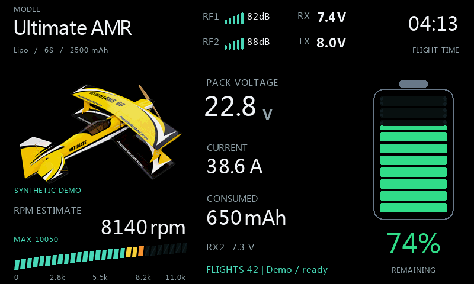
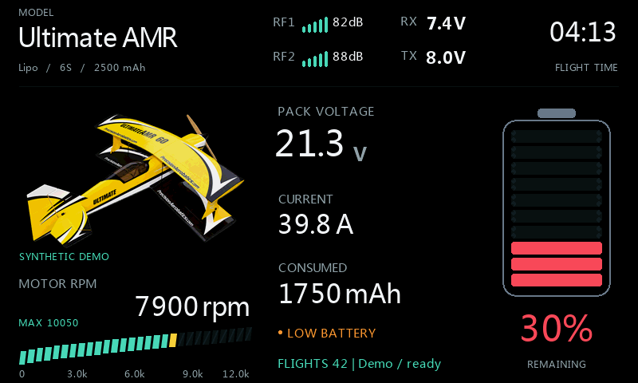
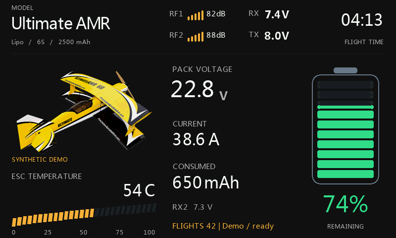

# VoltDeck: norsk hurtigguide

[Alle bilder og detaljer](Configuration.md) | [Installasjon](VoltDeck.md)

**Utviklingsversjon 2026.5-v2. Bildene er laget i ETHOS-simulatoren med
syntetiske data, ikke fra en virkelig flyging. Release avventer radiotest.**

## Installasjon og grunnoppsett

1. Legg Lua-filen i `scripts/VoltDeck/main.lua` på SD-kortet.
2. Velg **VoltDeck** i et fullskjerms widgetfelt.
3. Velg telemetrikildene for akkurat denne modellen.
4. Sett **Battery / Remaining from = Consumed mAh**, korrekt kapasitet og celletall.
5. Nullstill forbruksteller når du kobler til et nytt eller oppladet batteri.

Modellnavnet hentes fra valgt modell. **Appearance / Image source =
Selected model** bruker modellbildet som allerede er valgt i radioen.
Et tidligere Batt-widgetfelt må velge VoltDeck og sensorkilder på nytt.

## Velg visning nederst

| Visning | Lower deck / Show | Meter style |
|---|---|---|
| LCD turtall | RPM | Retro LCD |
| LCD turtall + effekt | RPM + Watts | Retro LCD |
| Turtall + effekt + cellevolt | RPM + W + cell | Retro LCD |
| Stor tallverdi | RPM, Watts eller Cell volts | Numeric |
| Valgfri sensor | Custom | Numeric eller Retro LCD |

For målt turtall: velg **Motor / RPM / RPM value = Measured RPM**, velg
**RPM source**, og sett **RPM max**, for eksempel 12000. Dette er
skalagrensen, ikke et løfte om motorens maksturtall.

For RPM + Watt: sett **Watt max**, for eksempel 1600 W. Effekten beregnes
fra pakkespenning ganger strøm. 22,8 V ganger 38,6 A gir omtrent 880 W.
Dette er elektrisk tilført effekt, ikke mekanisk effekt på propellen.

Cellevolt er pakkespenning delt på antall celler. Gjennomsnittet kan skjule
en svak enkeltcelle og erstatter ikke måling av hver celle.

## Uten RPM-sensor

Velg **RPM value = KV x volts (est.)**, oppgi motorens KV og velg gjerne
**RPM scale = Full-pack KV**. Skalaen blir fast ut fra fulladet pakke,
mens visningen følger aktuell spenning og eventuell voltage sag.

Eksemplet bruker 420 KV og en illustrativ faktor på 85%. Dette er ikke
en anbefalt standardkorreksjon for propellbelastning. Bruk egne målinger,
eller behold 100% for teoretisk friløpspotensial. Verdien er merket
**RPM ESTIMATE** og må ikke forveksles med målt turtall.

## Batteri, bakgrunn og lyd

Med 2500 mAh kapasitet og 650 mAh forbrukt blir gjenstående kapasitet
1850 mAh, altså 74%. Batteriet blir gult ved 40%, oransje ved 35% og rødt
ved 30% eller lavere. Over 40% er det grønt.

Velg **Appearance / Background = Radio theme**, **Black** eller **Custom**.
Med Custom kan du velge bakgrunnsfarge og aksentfarge. Tomt fontfelt bruker
radioens innebygde fonter.

Under **Battery alert** velger du lydfil og repetisjonsintervall.
Sett lydmappe først, åpne innstillingene igjen, og velg **Alert WAV**.
Filen må være PCM WAV, 32 kHz, mono, 16-bit. Ugyldig eller manglende fil
gir tone i stedet. Alarmen utløses ved 30% eller lavere, men er deaktivert
i forhåndsvisning og i bildenes private demokjøring.

## Valgfri telemetri

Velg **Show = Custom**, velg sensoren og sett en passende min/max-skala.
Her vises syntetisk ESC-temperatur på 54 C med 0-100 som skala.
Enheten kommer fra sensoren; widgeten oppretter ikke nye sensorer i modellen.

## Flylogg og RF-grafer

Åpne **Flight log** i widgetmenyen. Eksemplet viser 5:18, 10350 rpm maks,
64,8 A maks og 20,8-25,2 V. **42 flights er et eksempel, ikke en ekte teller.**

For faktisk logging: velg arm-betingelse og throttle-kilde. Standardfiltrene
er minst 60 sekunder og minst 50% throttle i til sammen 5 sekunder.
Still throttle-området korrekt: normalt -1024 til 1024 for kanalkilden,
eller 0 til 100 hvis kilden gir prosent. En passende **Airborne gate**
kan gi bedre filtrering, men en lang benktest kan likevel bli telt.

Velg RSSI-kilder for dB-grafer eller VFR-kilder for prosentgrafer.
Gul/rød grafmerking er visuelle grenser, ikke radioens telemetrialarmer.
Brudd i grafen betyr manglende data. Bare telleren lagres permanent;
siste flygings statistikk og grafer ligger i RAM.

RF-tegningen er begrenset: opptil 180 historikkpunkter blir til maksimalt
48 minimumsbevarende tidsfelt per kanal. Korte signalfall beholdes, og
manglende data bryter kurven. Beregningen fordeles over flere oppdateringer;
selve tegningen bruker ferdige koordinater. Grafen kan ligge noen sekunder
etter sanntid. De nye RF-bildene bruker 180 syntetiske inngangspunkter.
Optimaliseringen trenger fortsatt bekreftelse på fysisk radio før release.

## Modellbilder og sikkerhet

Eksempelbildet er 290 x 191 piksler. Bruk vanlig 8-bit RGB/RGBA PNG.
480 x 272 og 480 x 320 kan brukes, men tar mer dekodet bildeminne uten
større bildefelt i widgeten. 800 x 480 er over widgetens pikselgrense.

Modellinnstillinger og sensorkilder er modellspesifikke. Ta privat backup
av modellfil, begge innstillingsfiler og tellerfiler. Ikke bruk en annen
modells lagrede filer som en ferdig konfigurasjon.

Behold radioens egne alarmer, failsafe og sikkerhetskontroller.
Bildene dokumenterer utseendet; radiotesten din avgjør hva som må rettes
før vi lager en release.

